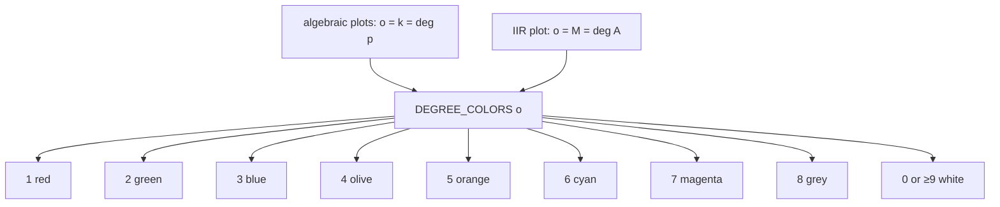

# Constellatio Numerorum


![algebraic plane scatter, coeffs in [-4,4]](algebraics/algebraic_plane_readme.png)


Stephen J. Brooks's [algebraic numbers](https://en.wikipedia.org/wiki/Algebraic_number) sketch, reimplemented as additive Lorentzian blobs in the complex plane.

```
common/        splat + batched float64 roots
algebraics/    integer-polynomial roots
iir-poles/     random Schur-stable IIR poles
```

`requirements.txt`: numpy, pygame, Pillow, matplotlib. GPU: PyTorch + CUDA.

## Colour

All three plots share one hue table: the same `o` always gives the same RGB from `DEGREE_COLORS` in `common/render.py` (`color_for_degree`, or `degree_color` in the scatter script). What `o` counts depends on the plot; brightness and mark size do not.

`color_for_degree` picks RGB from `DEGREE_COLORS[o]`. Each point stores `o` in `points["o"]` or `pts["o"]`.



<table>
  <thead>
    <tr>
      <th>colour</th>
      <th><code>o</code></th>
      <th>algebraic plots</th>
      <th>IIR plot</th>
    </tr>
  </thead>
  <tbody>
    <tr>
      <td><span style="background-color:#FF0000;color:#fff;padding:2px 8px;">red</span> 1.00, 0.00, 0.00</td>
      <td>1</td>
      <td>degree-1 integer polynomial</td>
      <td>order-1 filter</td>
    </tr>
    <tr>
      <td><span style="background-color:#00FF00;color:#000;padding:2px 8px;">green</span> 0.00, 1.00, 0.00</td>
      <td>2</td>
      <td>degree 2</td>
      <td>order 2</td>
    </tr>
    <tr>
      <td><span style="background-color:#0000FF;color:#fff;padding:2px 8px;">blue</span> 0.00, 0.00, 1.00</td>
      <td>3</td>
      <td>degree 3</td>
      <td>order 3</td>
    </tr>
    <tr>
      <td><span style="background-color:#B3B300;color:#000;padding:2px 8px;">olive</span> 0.70, 0.70, 0.00</td>
      <td>4</td>
      <td>degree 4</td>
      <td>order 4</td>
    </tr>
    <tr>
      <td><span style="background-color:#FF9900;color:#000;padding:2px 8px;">orange</span> 1.00, 0.60, 0.00</td>
      <td>5</td>
      <td>degree 5</td>
      <td>order 5</td>
    </tr>
    <tr>
      <td><span style="background-color:#00FFFF;color:#000;padding:2px 8px;">cyan</span> 0.00, 1.00, 1.00</td>
      <td>6</td>
      <td>degree 6</td>
      <td>order 6</td>
    </tr>
    <tr>
      <td><span style="background-color:#FF00FF;color:#fff;padding:2px 8px;">magenta</span> 1.00, 0.00, 1.00</td>
      <td>7</td>
      <td>degree 7</td>
      <td>order 7</td>
    </tr>
    <tr>
      <td><span style="background-color:#999999;color:#fff;padding:2px 8px;">grey</span> 0.60, 0.60, 0.60</td>
      <td>8</td>
      <td>degree 8</td>
      <td>order 8</td>
    </tr>
    <tr>
      <td><span style="background-color:#FFFFFF;color:#000;border:1px solid #666;padding:2px 8px;">white</span> 1.00, 1.00, 1.00</td>
      <td>0, ≥9</td>
      <td>slot unused; degree/order 9+</td>
      <td>same</td>
    </tr>
  </tbody>
</table>

Algebraic plots: $`o = k = \deg p`$ for the enumerated $`p(z)=\sum_{n=0}^{k} c_n z^n`$ with $`c_k>0`$. The colour tags the polynomial you enumerated. A cubic in the list is blue at every root, even roots that also satisfy a linear or quadratic.

IIR plot: $`o = M = \deg A`$ for $`A(z)=1+\sum_{m=1}^{M} a_m z^{-m}`$ from reflection coeffs $`k_0,\ldots,k_{M-1}`$.

Brightness and mark width use different formulas on each plot:

| plot | brightness | mark width |
| --- | --- | --- |
| algebraic blobs | hit count $`w`$ at the same rounded $`(x,y,h,o)`$; splat amplitude $`w \cdot C(o)`$ | blob radius $`r = k_1 k_2^{h-3}`$; lower Brooks $`h`$, wider glow |
| algebraic scatter | alpha $`\propto k_2^{h-3}`$ and $`\log(1+w)`$ (default `--weight both`) | dot area $`\propto (\max|c_i|)^{-1}`$ and $`\sqrt{w}`$ |
| IIR poles | $`0.55 \cdot \mathrm{clip}(\log(1+Q)/6.5,\ 0.06,\ 1) \cdot C(o)`$; higher $`Q`$ when $`|z|`$ is closer to 1 | $`k_1 k_2^{M-2}`$; wider at higher order |

Brooks complexity (algebraic plots):

$$
h = \sum_{n=0}^{k} \left(|c_n| + 1\right)
$$

IIR pole sharpness:

$$
Q \approx \frac{0.5\,|z|}{1-|z|}
$$

## Algebraic numbers

Defaults $k_1=0.125$, $k_2=0.5$. Leading coeff $c_k>0$, degree $k\ge 1$. Each $h$ is a unary bit encoding of $|c_n|$, then all sign patterns on the non-leading nonzero coeffs. CPU: `numpy.roots`. GPU: batched float64 companion eigenvalues. Hits at the same $(x,y,h)$ and degree merge into one blob with $`w>1`$.

Viewport is three numbers passed to `render`: centre $`(ox, oy)`$ in the complex plane and `zoom` (pixels per unit). Default centres on the origin:

```bash
# full view (top image)
python3 algebraics/algebraics_gpu.py --maxh 17 --width 3840 --height 2160 \
  --png algebraics/algebraics_h17_3840px_default.png

# detail crop like [Algebraicszoom.png](https://commons.wikimedia.org/wiki/File:Algebraicszoom.png) (second image)
python3 algebraics/algebraics_gpu.py --maxh 17 --width 1920 --height 1080 \
  --ox 0.86 --oy 0.58 --zoom 820 \
  --png algebraics/algebraics_h17_wiki_crop.png
```

For another width, scale `zoom` with width. At 3840 px wide the same crop uses `--zoom 1640` ($820 \times 3840/1920$).

CPU path:

```bash
python3 algebraics/algebraics.py --maxh 15 --png algebraics/algebraics.png
```

Colab: `algebraics/colab_algebraics.ipynb`. Brooks used `maxh=15`; T4: 17, A100: 18.

`algebraics/algebraics_h17_3840px_default.png` (T4, batch 8192, 3840×2160, default viewport): 803744 polys, 5744032 roots, 4660457 unique blobs, GPU roots 492 s.

## Algebraic plane (scatter)

Same hue table as above. Low degree drawn on top.

- `--weight height`: size $`\propto 1/\max|c_i|`$, alpha $`\propto 1/\max|c_i|`$
- `--weight h`: size and alpha both $`\propto k_2^{h-3}`$
- `--weight both` (default): size from coefficient height, alpha from Brooks $`h`$; hit count $`w`$ boosts both

`--enum box`: integer polys with coeffs in $`[-L,L]`$. `--enum brooks`: Brooks bit encoding, needs `--gpu`. Cache: `algebraics/cache/plane_{enum}_{tag}.npz`; `--recompute` to rebuild.

```bash
python3 algebraics/algebraic_plane.py --png algebraics/algebraic_plane.png
python3 algebraics/algebraic_plane.py --gpu --coeff-range 4 --max-degree 5 --png algebraics/algebraic_plane_3840px.png
python3 algebraics/algebraic_plane.py --gpu --enum brooks --maxh 12 --weight h --png algebraics/algebraic_plane_brooks.png
```

Second image: 1920 resize of `algebraic_plane_3840px.png` (Colab T4, `coeff-range=4`, 2.53M roots, ~4.6 min). Default `coeff-range=3`: 222k blobs.

## Random stable IIR poles

Reflection coeffs with $`|k|<1`$; Levinson step-up to Schur polynomials. High order piles up near $`|z|=1`$.

```bash
python3 iir-poles/lattice_poles.py --orders 2-16 --n 350
python3 iir-poles/lattice_poles.py --gpu --orders 2-18 --n 1500 --width 3840 --height 2160 --png iir-poles/poles_o18_3840px.png
```

`iir-poles/poles_o18_3840px.png` (T4, orders 2-18): ~197k poles, median $`|z|`$ 0.76 (order 2) to 0.999 (order 18), ~1 min GPU. Colab: `iir-poles/colab_poles.ipynb`.
